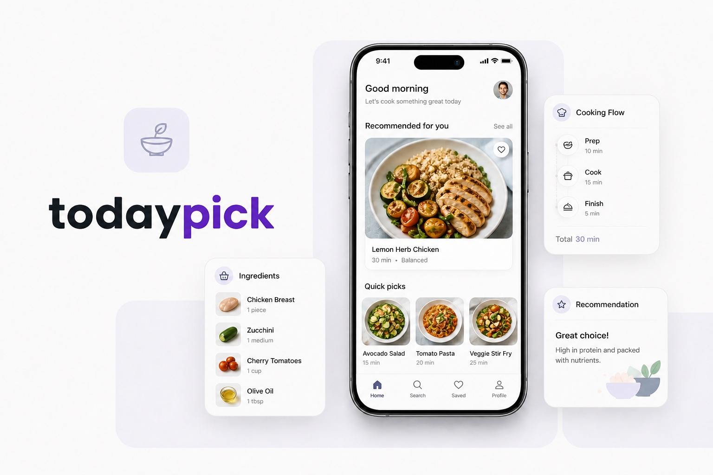
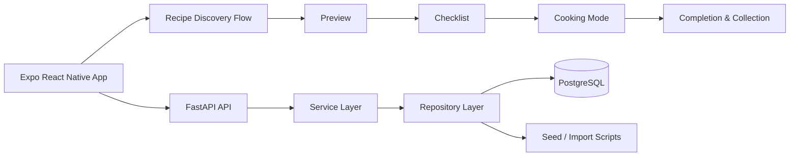
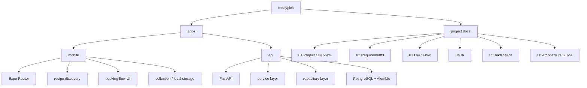

# TodayPick



**TodayPick**은 냉장고에 있는 재료와 오늘의 상황을 바탕으로,  
지금 바로 만들 수 있는 요리를 추천하고 실제 조리 흐름까지 이어주는 모바일 레시피 서비스입니다.

레시피를 많이 보여주는 앱보다,  
`오늘 뭐 해먹지?`를 빠르게 결정하고 끝까지 만들게 하는 경험을 만드는 데 집중했습니다.

## What It Solves

- 지금 가진 재료로 만들 수 있는 요리가 바로 떠오르지 않는 문제
- 레시피를 봐도 실제로 만들 수 있는 상태인지 판단하기 어려운 문제
- 조리 중 긴 레시피 글보다 한 단계씩 따라가고 싶은 문제

TodayPick은 이 흐름을  
`재료 선택 → 추천 결과 → 레시피 미리보기 → 재료 체크 → 조리 모드 → 완료 기록`  
으로 연결해 해결합니다.

## Key Experience

- **재료 중심 탐색**  
  사용자가 가진 재료를 먼저 기준으로 삼아 추천을 시작합니다.

- **빠른 판단이 가능한 미리보기**  
  필요한 재료, 시간, 난이도, 준비 과정을 먼저 보여줘서 만들 수 있는지 빠르게 판단할 수 있습니다.

- **핵심 재료 체크리스트**  
  조리 전 꼭 필요한 재료를 확인하고, 준비된 상태에서 다음 단계로 넘어가도록 설계했습니다.

- **단계별 cooking mode**  
  긴 레시피 본문 대신 한 단계씩 집중해서 따라갈 수 있는 조리 화면과 타이머를 제공합니다.

- **완료 후 기록 경험**  
  완성한 요리를 사진, 메모, 컬렉션으로 남길 수 있어 단발성 사용에서 끝나지 않습니다.

## Architecture



## Structure



## Tech Stack

- **Mobile**: Expo 52, React Native 0.76, Expo Router, AsyncStorage, Expo Image Picker
- **Backend**: FastAPI, SQLAlchemy, Alembic, PostgreSQL, Psycopg 3

## Implemented Flow

- 메인 홈
- 재료로 찾기 / 테마로 찾기
- 추천 결과 목록
- 레시피 미리보기
- 재료 체크리스트
- 단계별 조리 모드 + 타이머
- 조리 완료 화면
- 찜 / 인증사진 / 한 줄 메모
- 내 요리 컬렉션

## Run

### Mobile

```bash
cd apps/mobile
npm install
npm run ios
```

### API

```bash
cd apps/api
python3 -m venv .venv
source .venv/bin/activate
pip install -e .
uvicorn app.main:app --reload
```

### PostgreSQL

```bash
cd apps/api
source .venv/bin/activate
export DATABASE_URL='postgresql+psycopg://miju@127.0.0.1:5432/todaypick'
alembic upgrade head
python -m app.scripts.import_recipes
uvicorn app.main:app --reload
```

## Docs

- [01_Project_Overview.md](./01_Project_Overview.md)
- [02_Requirements.md](./02_Requirements.md)
- [03_User_Flow.md](./03_User_Flow.md)
- [04_Information_Architecture.md](./04_Information_Architecture.md)
- [05_Technical_Stack.md](./05_Technical_Stack.md)
- [06_Architecture_Guide.md](./06_Architecture_Guide.md)
- [apps/api/README.md](./apps/api/README.md)
